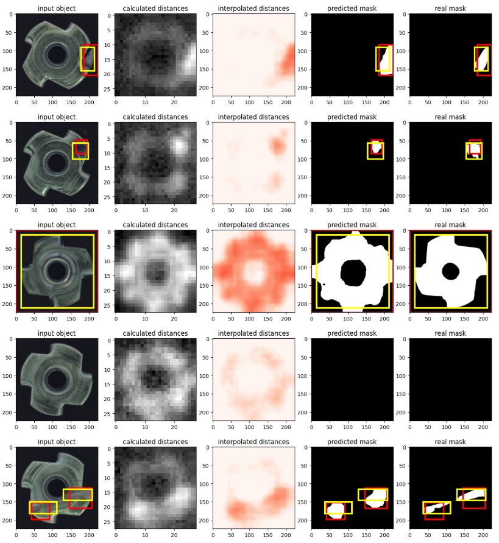
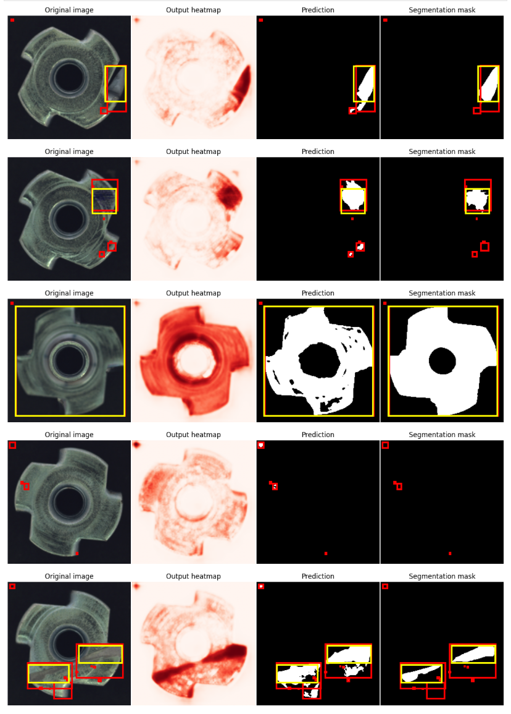

# Defect Segmentation on MVTec AD (Metal Nut)

This project focuses on **computer vision for defect detection**, specifically **segmentation of defects** in industrial components.  
We use the **MVTec Anomaly Detection (AD)** dataset with experiments on the **Metal Nut** category.  

The approach leverages **feature embeddings from ResNet50** and a **memory-augmented segmentation network** to identify and localize defects.

---

## Project Overview

- **Task**: Pixel-level defect segmentation  
- **Dataset**: [MVTec AD](https://www.mvtec.com/company/research/datasets/mvtec-ad) - *metal_nut* subset  
- **Architecture**:
  - **ResNet50** backbone for feature extraction  
  - **MemoryNet / UpMemoryNet** modules for segmentation  
  - Memory-based approach to handle normal/abnormal pattern separation  
- **Loss function**: BCE + Dice loss (`BCEDiceLoss`)  
- **Metric**: Dice coefficient  

---

## Repository Structure

```
.
├── Segmentation.ipynb   # Main Jupyter Notebook with implementation and experiments
├── README.md            # Project documentation
└── requirements.txt     # Dependencies (optional)
```

---

## Requirements

Install dependencies via:

```bash
pip install -r requirements.txt
```

---

## Dataset

We use the **metal_nut** subset of MVTec AD.  
The dataset consists of:  
- **Train**: only good (defect-free) samples  
- **Test**: mixture of good and defective samples  
- **Ground truth masks**: binary segmentation masks for defective regions  

Example dataset structure:
```
metal_nut/
├── train/good/
├── test/
│   ├── good/
│   ├── scratch/
│   ├── crack/
│   └── ...
└── ground_truth/
    └── defect_masks/
```

---

## Model & Training

- **Feature extractor**: ResNet50 (ImageNet pretrained)  
- **Segmentation head**: MemoryNet / UpMemoryNet with feature pooling  
- **Loss**: Binary Cross-Entropy + Dice Loss  
- **Optimizer**: AdamW  
- **Scheduler**: MultiStepLR  

Training pipeline includes:
1. Data loading & preprocessing (resize to 224x224)  
2. Memory bank construction for embedding separation  
3. Training with BCE + Dice loss  
4. Evaluation with Dice coefficient  

---

## Results

The model achieves competitive **Dice scores** on the test set, successfully localizing scratches, cracks, and other defects on metal nuts.  

Visualizations include:
- Ground truth vs. predicted masks  
- Heatmaps of anomaly likelihood  
- Bounding boxes for defective regions  

---

## Examples


### MemoryNet - (PatchCore based) stages visualisation

**The masks are very blurry**

*(yellow bounding boxes are around actual masks, red ones are around predicted defects)*



### UpMemoryNet (model with refined masks) stages visualisation

**The masks follow the contours more accurately, but small false-positive defects appear**

*(yellow bounding boxes are around actual masks, red ones are around predicted defects)*




---

## How to Run

1. Clone the repository:
   ```bash
   git clone https://github.com/AleksandrRodkin/Segmentation_MVTec_AD.git
   cd segmentation-metal-nut
   ```

2. Launch Jupyter Notebook:
   ```bash
   jupyter notebook Segmentation.ipynb
   ```

3. Follow the notebook cells to:
   - Download the dataset  
   - Train the segmentation model  
   - Evaluate and visualize results  

---

## Future Work

- Overcome the occurrence of false positive defects when using the UpMemoryNet model
- Extend to other categories in MVTec AD (e.g., carpet, pill, bottle) 
- Explore **transformer-based segmentation architectures**
- Apply real-time deployment for industrial quality inspection

---

## License

This project is intended for **research and educational purposes only**.  
Please review the [MVTec AD license](https://www.mvtec.com/company/research/datasets/mvtec-ad) before using the dataset.  
